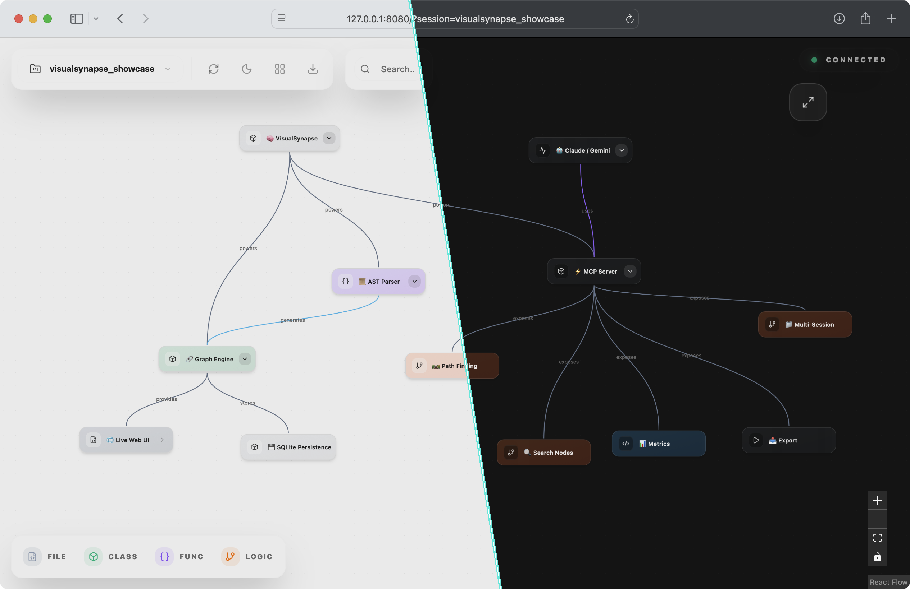

<div align="center">
  <!--  -->

  # VisualSynapse
  
  **Your Codebase, Re-Imagined as a Living Organism.**
  
  [](https://python.org)
  [](https://modelcontextprotocol.io)
  [](LICENSE)
</div>

---
A code visualization tool that turns source code, files, and entire folder structures into interactive graphs. With AI assistance, you can map anything from a single function to a full project hierarchy.

## The Problem: When Coding with AI, You Can't See the Logic

AI writes code at the speed of thought, but it lacks **sight**. When you generate functions, refactor modules, or debug errors in a chat window, you are working in fragmented, linear text.

**You lose the Mental Map.**

*   **Context Blindness**: You paste `main.py` but forget `utils.py`. The AI hallucinates a connection that doesn't exist because it can't "see" the import graph.
*   **Structural Decay**: As you iterate with LLMs, spaghetti code forms not because the logic is bad, but because the *architecture* is invisible.
*   **The Review Gap**: Reviewing 500 lines of AI-generated code is exhausting. You skim, you miss bugs, and you merge technical debt.

**It's time to stop reading code and start seeing it.**

<div align="center">
  
</div>

## The Solution: VisualSynapse

VisualSynapse is an **MCP (Model Context Protocol) Server** that transforms your static codebase into a dynamic, queryable, and interactive knowledge graph. 

It doesn't just "diagram" your code; it creates a persistent **Session**—a mental model of your workspace that you can explore, manipulate, and expand.

### Key Usasge

*   **⚡ Live Code Mapping**: Automatically parses Python, JS, and TS files to build a hierarchical graph of Files > Classes > Functions > Logic.
*   **🕸️ Dead Code Detection**: Instantly spot "orphan nodes"—functions or classes with zero incoming edges.
*   **🔎 Semantic Trace**: Use the `find_path` tool to discover the shortest route between two disparate parts of your system.
*   **💾 Persistent Sessions**: Your graph isn't ephemeral. Create a session (`planning_auth_flow`), populate it, and come back to it days later.
*   **🤖 LLM-Ready**: Designed specifically for AI Agents. Tools like `add_node`, `search_nodes`, and `analyze_session` give LLMs "eyes" on the architecture.

> **Note:** Some of the Key Usage is far from current reality. Advanced features like Live Mapping and Semantic Trace are experimental/roadmap items. We are actively building towards this vision and welcome contributions.


## Installation

### Method 1: Run directly (Recommended)
You can run the latest version directly without installing anything manually:

```bash
uvx --from git+https://github.com/visualsynapse/visualsynapse synapse serve
```

### Method 2: Install as a tool
To have the `synapse` command available globally:

```bash
uv tool install git+https://github.com/visualsynapse/visualsynapse
synapse serve --port 8080
```

### Method 3: Development / From Source
If you have cloned the repository:

1. Sync dependencies:
   ```bash
   uv sync
   ```
2. Run using `uv run` (handles environment automatically):
   ```bash
   uv run synapse serve
   ```

## Usage

### Web UI
Start the server using one of the methods above. Then open [http://localhost:8080](http://localhost:8080) in your browser.

### As MCP Server
Add to your MCP config:

```json
{
  "visual-synapse": {
    "command": "uvx",
    "args": ["--from", "git+https://github.com/visualsynapse/visualsynapse", "synapse-mcp"]
  }
}
```


## Contributing

This project is small and under development. If you want to contribute:

1. Fork the repo
2. Make your changes
3. Test that the server starts and basic parsing works
4. Submit a PR with a clear description of what you changed and why

Keep PRs focused. One fix or feature per PR.

If you find a bug, open an issue with:
- What you expected to happen
- What actually happened
- Steps to reproduce


## Technologies

### Core Analysis
- **Tree-sitter**: Robust AST parsing for Python, JavaScript, and TypeScript.
- **Logic Extraction**: Captures control flow (if/else), loops (for/while), and exception handling.
- **Hierarchical Mapping**: transforms linear code into expandable File > Class > Function > Logic trees.
- **Smart Grouping**: automatically clusters complex logic blocks to simplify visual flow.
- **MCP (Model Context Protocol)**: Standardized interface for AI agent interaction.
- **FastAPI**: Efficient web server for graph data and static assets.

### Visualization
- **React Flow**: Interactive, node-based graph rendering with progressive disclosure.
- **Zustand**: Performant state management for large graph datasets.
- **Vite**: Modern build tooling.

## Structure & Optimizations

### Frontend 
- **React.memo & useMemo**: Heavy use of React's memoization to ensure stable frame rates even with hundreds of nodes. `CustomNode` components are memoized to prevent unnecessary re-renders during graph updates.
- **Efficient Child Counting**: Implements a dual-strategy for hierarchy calculations—using a "Fast Path" with pre-calculated backend data and a "Slow Fallback" for dynamic updates.

### Backend
- **SQLite WAL Mode**: The graph database runs in **Write-Ahead Logging (WAL)** mode. This allows for high-concurrency performance, enabling the UI to read graph state while the parser is simultaneously writing new nodes.
- **Hybrid Storage Model**: Uses a relational schema for edges (`source`, `target`) but stores complex node metadata as **JSON blobs**. This provides the flexibility of a NoSQL document store with the ACID guarantees of SQL.

### Graph Algorithms
- **Structural Analysis**: Built-in BFS (Breadth-First Search) algorithms to detect orphan nodes, calculate graph components, and validate edge integrity on every save.
- **Pathfinding**: Optimized shortest-path algorithms to trace execution flow between any two code entities.

---

<div align="center">
  <b>Built by VisualSynapse</b><br>
  <i>Architecting bridges between logic and culture.</i>
</div>